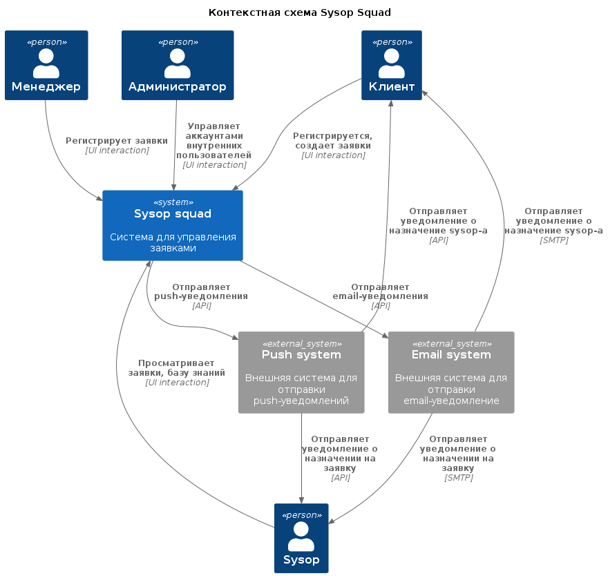

# Sysop Squad

An electronics giant needs a new trouble-ticket system for their customer-facing IT consultants (the Sysop Squad) in their stores nationwide

* Users: thousands of customers, hundreds of consultants, hundreds of store staff
* Requirements:
  * trouble tickets can be entered by either call-center receptionists, store staff, or customers online
  * tickets route to the appropriate consultant based on location, availability and skill
  * consultants should only need a mobile device
  * customers enter consultant evaluation after service
  * consultant tracks work performed in customer record(s) for future reference
* Additional Context:
  * uptime is critical to the company's reputation
  * the site's performance must degrade gracefully under heavy load
  * good routing of requests is critical to making a profit

# Бизнец контекст

Компания X - крупный гигант электроники, имеющий множество розничных магазинов по всей стране. Компания предоставляет услугу по устранению неполадок с устройствами, приобритенными пользователями. Пользователь оставляет заявку с описанием неисправности. Заявка перенаправляется специалисту, который прибудет к месту проживания пользователя с целью устранения неполадок.

На текущий момент отсутствует система для управления заявками пользователей - регистрация заявки происходит путем звонка в сервис поддержки, заявки обрабатываются "вручную", что часто приводят к их потерям, обработка заявок происходит медленно. Это приводит к финансовым и репутационным потерям компании. Есть риск того, что данное направление в компании будет закрыто.

# Бизнес цели

Разработать высокопроизводительную и надежную систему для управления заявками по устранению неисправностей устройств пользователей, что позволит сохранить прибыльное направление в бизнесе.

# Бизнес драйверы

* Риск закрытия прибыльного направления в бизнесе
* Текущий способ управления заявками неэффективен
* Репутационные потери
* Увольнение сотрудников в случе закрытия направления

# Стейкхолдеры

* Клиент - пользователи, оставляют заявку с описанием неисправности онлайн, по телефону, в магазине компании X
* Sysop - эксперты, занимаются исправлением неисправностей
* Менеджер - принимает заявки от пользователей по телефону
* Администратор - управляет учетными записями sysop-ов и менеджеров

# Пользовательские истории

* Клиент
  * Регистрируется в системе
  * Оставляет заявку с описанием неисправности онлайн (краткая анкета, чтобы выбрать подходящего специалиста + дополнительное текстовое описание проблемы)
  * Оставляет заявку с описанием неисправности по телефону
  * Получает уведомление о назначении sysop-а (push, email)
  * Выбирает дату встречи с sysop-ом в календаре
  * Просматривает свои текущие и предыдущие заявки
  * Оставляет отзыв о работе над заявкой
* Sysop
  * Просматривает список назначенных на него заявок
  * Просматривает историю заявок пользователей, заявки которых на него назначили
  * Получает уведомления о новых заявках (push, email)
  * Просматривает базу знаний
  * Составляет отчет о выполненой работе
* Менеджер
  * Принимает заявку от клиента по телефону, либо в магазине компании X
  * Регистрирует заявку в системе
  * Выбирает sysop-а для решения создаваемой заявки, если необходимо
* Администратор
  * Создает аккаунты для менеджеров и sysop-ов
  * Блокирует аккаунты менеджеров и sysop-ов
  * Проставляет уровень навыков sysop-а в его аккаунте (для возможности автоматического назначения sysop-а на заявку)

# Атрибуты качества и нефункциональные требования

* **Доступность**: downtime не более 8.76 часов в год
* **Производительность**: время ответа для клиента не более 2с при 10000 одновременных пользователей. Поиск по базе знаний до 5с.
* **Надежность**: заявки не должны быть утеряны
* **Безопасность**: данные клиентов должны храниться в защищенном хранилище
* Скорость назначения sysop-ов на заявку - не позднее чем за 12 часов

# Критические сценарии и характеристики

Сценарии:
* Клиент регистрируется в системе
* Клиент оставляет заявку
* Sysop обрабатывает заявку

Характеристики:
* **Доступность**: downtime не более 8.76 часов в год
* **Производительность**: время ответа для клиента не более 2с при 10000 одновременных пользователей, количество запросов от пользователей - не более 50 в минуту. Поиск по базе знаний до 5с.
* **Надежность**: заявки не должны быть утеряны

# Контекстная схема

# ADR
* [001 - Вендорное решение vs Собственное решение](adr/001-vendor-vs-own.md)
* [002 - Архитектурный подход](adr/002-architectural-approach.md)