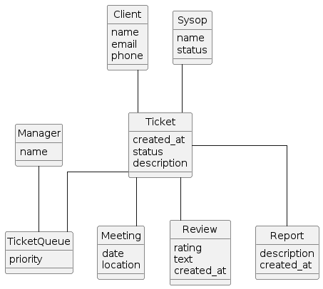
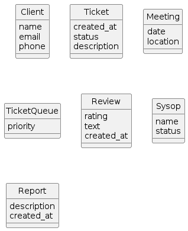
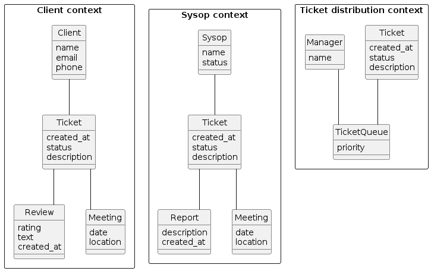

# Sysop squad - Функциональная декомпозиция

## Модель предметной области

## Решение 1 - Декомпозиция по сущностям

### Оценка стоимости изменений
* Клиент может прикладывать файлы к тикету
  * C(Ticket)
* Оператор может прикладывать файлы к отчету
  * C(Ticket)
* Разные приоритеты для разных клиентов
  * C(Client) + C(Ticket queue)
* Клиент заполняет анкету, по которой выбирается подходящий sysop
  * C(Client) + C(Questionnaire)? + C(Ticket distribution)

## Решение 2 - Декомпозиция по баунд конекстам

### Оценка стоимости изменений
* Клиент может прикладывать файлы к тикету
  * C(Client) + C(Sysop)
* Оператор может прикладывать файлы к отчету
  * C(Sysop)
* Разные приоритеты для разных клиентов
  * C(Client) + C(Sysop) + C(Ticket distribution)
* Клиент заполняет анкету, по которой выбирается подходящий sysop
  * C(Client) + C(Sysop) + C(Ticket distribution)

## Сравнительный анализ

Основные изменения изменения в системе будут происходить с модулем тикета, однако, поскольку планируется рост системы, предпочтительно решение 2.
